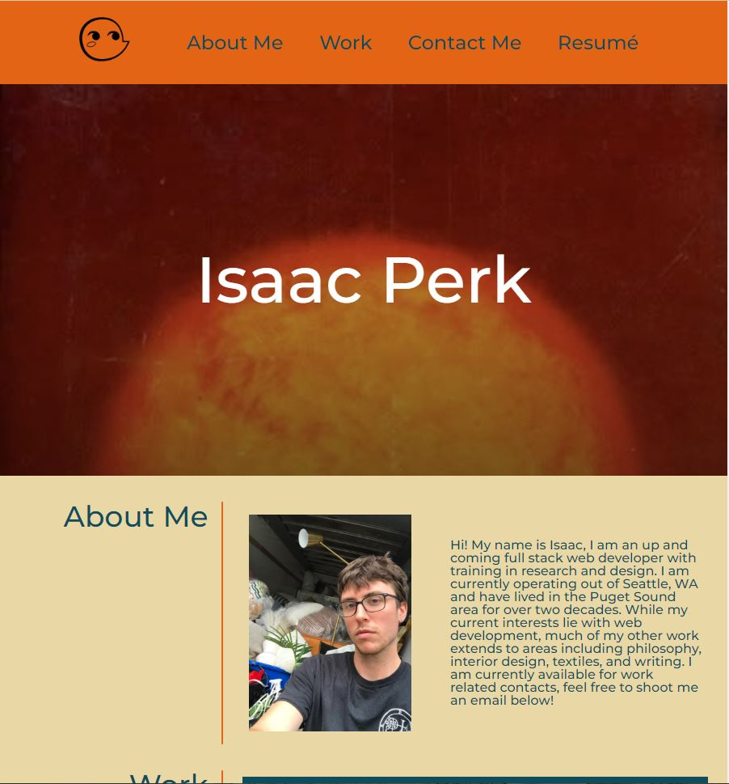

# Professional Portfolio

## Description

Hi! Here is a portfolio page I made using HTML and CSS. The intention of this site is to have one place that I can direct people to when they want to see more of my work or get in contact with me. There are several projects showcased in the 'work' section, and contact links at the foot of the page where people can get in touch. This project really helped me get used to some advanced CSS techniques, especially flex-box. Cheers!

## Screen Capture

## License

MIT License
